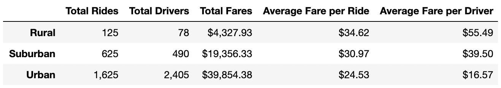

# PyBer Analysis

## Overview: 
The purpose of this analysis is to create a summary DataFrame of the ride-sharing data by city type for PyBer (a python-based ride-sharing app company). Then, create a multi-line graph to showcase the relationship between the total weekly fares for each city type to help PyBer improve access to ride-sharing services and determine affordability. 

Resources: [city_data.csv](Resources/city_data.csv), [ride_data.csv](Resources/ride_data.csv)\
Software: Jupyter Notebook 6.1.4

## Results: 
Urban cities have the highest total rides, drivers and fares out of the three city types, but the lowest average fare per ride and per driver. Rural cities have the highest average fare per ride and per driver, and the lowest number of total rides, drivers and fares. Suburban cities fall between urban and rural cities on all five metrics. A detailed summary of the ride-share data by city type is below. 

#### PyBer Summary

Looking at the performance of the weekly fare by city type, we see urban cities have the highest total weekly fare, and rural cities have the lowest, with suburban cities falling in-between urban and rural cities. A multi-line chart detailing the weekly fares by city type is below: 

#### PyBer Fare Summary Chart

## Summary: 
Based on the results, the first recommendation would be to decrease the fare prices in rural cities. By decreasing the fare in rural cities, it would decrease the average fare per ride and expand access to new riders who couldn’t previously afford the fare. Secondly, it would be beneficial to increase the number of drivers in both suburban and rural cities. This would increase driver availability and could increase the volume of total rides and total fares. Finally, decreasing the number of drivers in urban cities to increase avg. fare per driver. 
